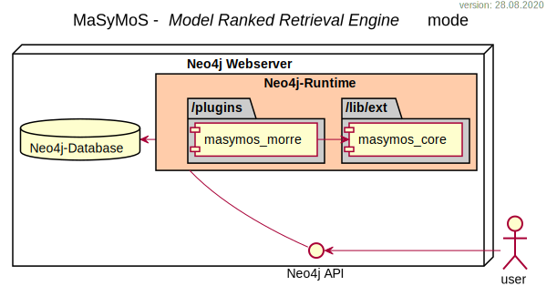

********
Overview
********

MaSyMoS consists of different parts: 

- ``masymos-core`` provides the base functionality
- ``masymos-morre`` is the search extender providing a REST-API
- ``masymos-cli`` contains the *command line interface*

Find all modules in the `MaSyMoS organisation on GitHub <https://github.com/MaSyMoS>`__.

MaSyMoS CLI
###########

MaSyMoS MORRE
#############

Words, Meanings and Connections
###############################

- Definitions of the several resource types:
    - resolve one URN to one Identification-schema-URL
    - resolve one Identification-schema-URL to many Resource-URLs

    URN
        unique identifier for one entry  
        i.e. `urn:miriam:pubmed:11429446`
    Compact Identifier
        unique identifier for one entry  
        i.e. `MIR:00000381`, `CHEBI:36927`
    Identification schemes
        an identifiers.org-URL
        i.e. `https://identifiers.org/uniprot:P0DP23`
    Resources
        the resolved URLs to the actual resources
